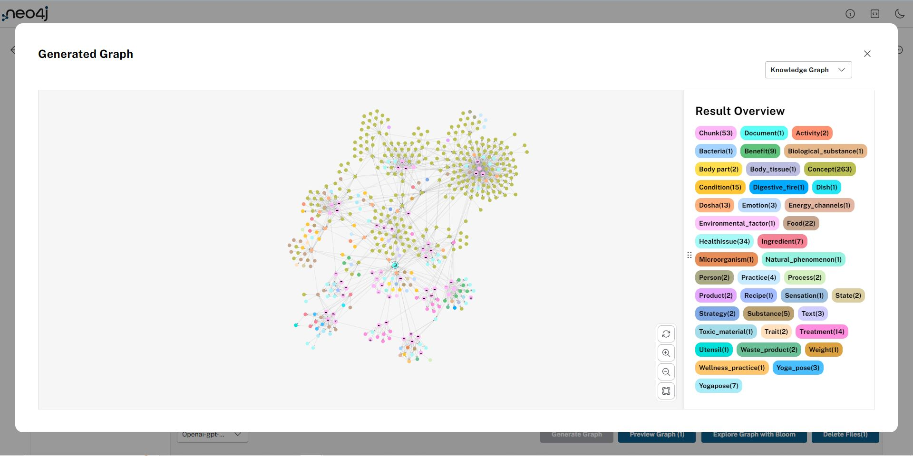
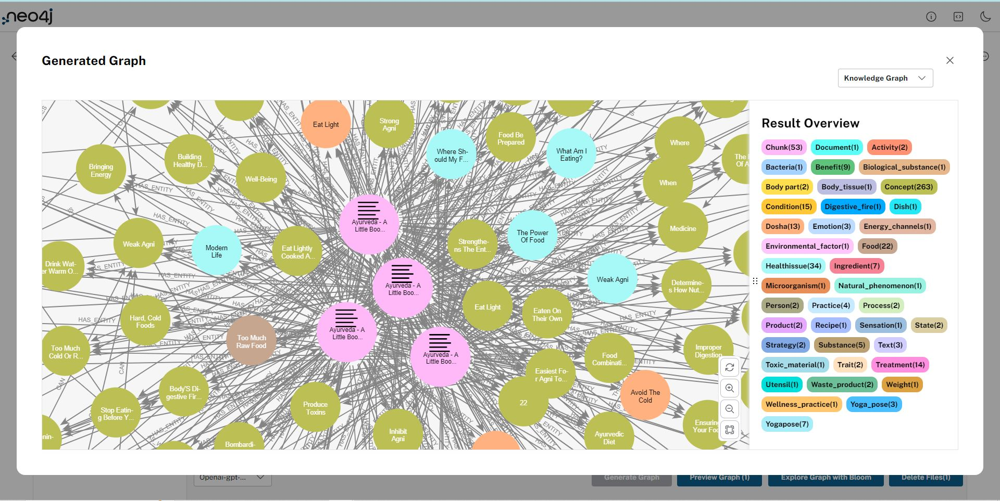
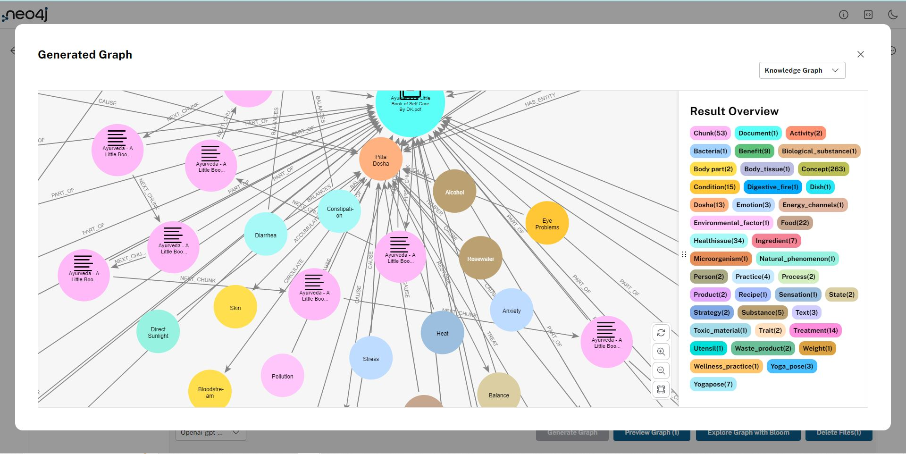
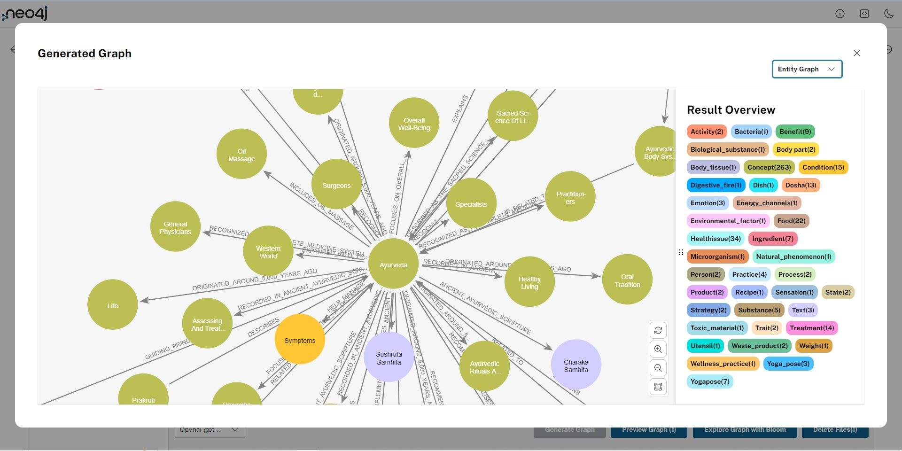
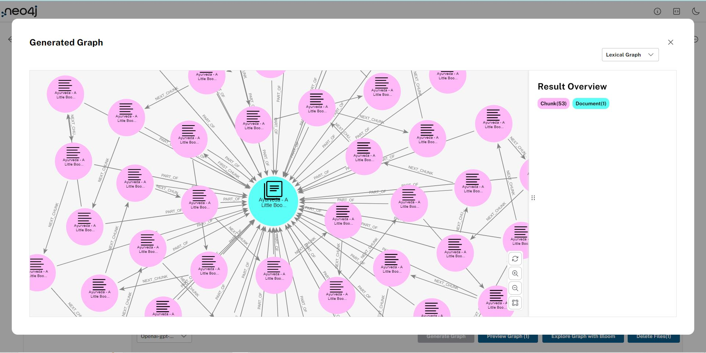
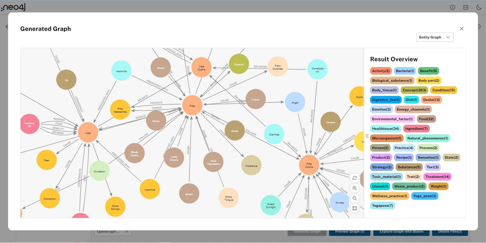

# 💬 Ayurveda 2.0

A simple Ayurveda Chatbot Streamlit app that utilizes Neo4J AuraDB and OpenAI's GPT models to respond to the user's health related queries with a Ayurvedic Solution.

[](https://ayurvedai.streamlit.app/)

### Knowledge Graph Snapshots







### How to run it on your own machine

1. Install the requirements

   ```
   $ pip install -r requirements.txt
   ```

2. Run the app

   ```
   $ streamlit run streamlit_app.py
   ```
